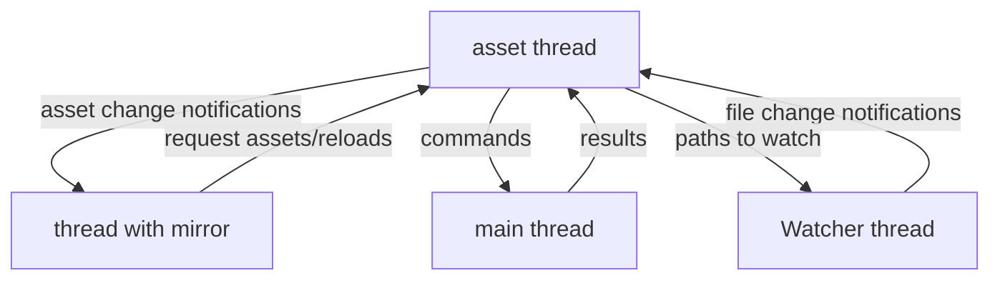

# Asset system
## Overview
The asset system works using a global index (see `index.lua`) that sends load and change notifications to one or multiple asset mirrors (see `mirror.lua`) in different threads which then update their contents.

All loading happens in the main asset thread where the global index is created and updated. To load an asset any thread has to request for it to be loaded. A reload can also be requested.

For operations that require to be run on the main thread (e.g. shader compilation) the loading process sends a request to the main thread which after finishing its frame processes it and sends the result back to the loading thread.

If hot reloading is enabled the watcher thread (see `watcher.lua`) will send file change notifications to the asset thread causing certain assets to be reloaded.



## Requesting
Requesting an asset will return a promise that is fulfilled as soon as the asset is loaded and mirrored to all threads
```lua
local assets = require("asset_system")
...
-- "some_key" is the key in the mirror
-- "text_file" is the loader (a function in asset_system.loaders)
-- "helloworld.txt" is a parameter given to the loader
assets.index.request("some_key", "text_file", "helloworld.txt"):done(function()
    -- the contents of "helloworld.txt" are now stored in assets.mirror.some_key
    print(assets.mirror.some_key)
end)
```

## Loader
Any asset before it appears in the index and gets mirrored to all threads must be requested with a loader which is a function that runs in the asset thread.

A loader can use other assets to create its own asset, these assets will then automatically note that the currently loading asset depends on them, so that once any of them changes this loader is called again. (note that if a loader depends on many assets all of them apart from the changed one are still cached)

Requesting other assets from a loader is blocking instead of asynchronous as it is running in the same thread in that case.
For example a json loader could look like this:
```lua
local json = require("extlibs.json.json")
...
function loaders.json(path)
    -- This loader will also be called again if this asset is reloaded.
    local text = index.local_request("text_file", path)
    return json.decode(text)
end
```
Note that `index.local_request` generates an asset key automatically based on the loader and its arguments. This ensures uniqueness among non-user keys and makes writing loaders a lot simpler. To avoid collisions with user keys, all of them are prefixed with an underscore.

## Reloading
While there is a promise for the initial request of an asset, once it is loaded subsequent changes due to hot reloading or calling reload manually will only change the asset/s in the mirror, so caching in local variables should only be done if the assignement is executed before the usages.
```lua
local assets = require("asset_system")
local async = require("async")
...
-- "some_key" is the key in the mirror
-- "text_file" is the loader (a function in asset_system.loaders)
-- "helloworld.txt" is a parameter given to the loader
assets.index.request("some_key", "text_file", "helloworld.txt"):done(function()
    -- the contents of "helloworld.txt" are now stored in assets.mirror.some_key
    print(assets.mirror.some_key)
end)
...
-- this will not call the callback with the print again since the promise is already done
async.await(assets.index.reload("some_key"))
-- the updated contents have to be read from the mirror again
print(assets.mirror.some_key)
```
