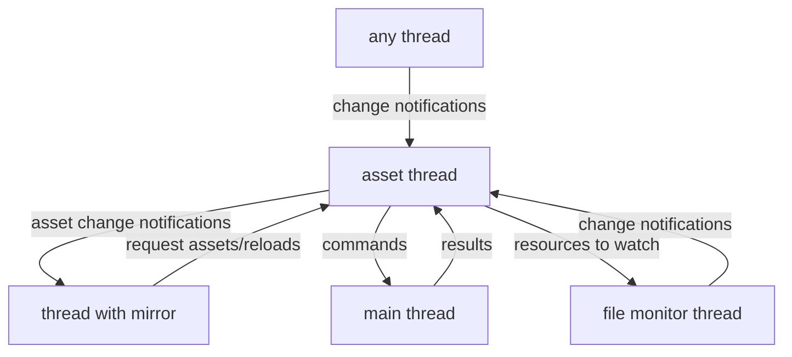

# Asset system
## Overview
The asset system works using a global index (see `index.lua`) that sends load and change notifications (see `mirror_server.lua`) to one or multiple asset mirrors (see `mirror_client.lua`) in different threads which then update their contents.

All loading happens in the main asset thread where the global index is created and updated. To load an asset any thread has to request for it to be loaded. A reload can also be requested.

The index internally uses ids that uniquely identify assets using their loader and the arguments passed to it. Already loaded assets are not reloaded when requested again.

The keys in the mirror are supplied by the user. Only assets that have a user supplied key get mirrored. It is possible to retroactively add a key to an asset by requesting it again (this will not cause a reload).

For operations that require to be run on the main thread (e.g. opengl shader compilation) the loading process sends a request to the main thread which after finishing its frame processes it and sends the result back to the loading thread.

Assets can depend on any type of external resource (files or data from a channel). Any thread can send change notifications causing certain assets to be reloaded. Change notifications need to be sent by the user if the resource is not a file or if hot reloading is disabled. If hot reloading is enabled the file monitor thread (see `file_monitor/init.lua`) will send change notifications for files.



## Requesting
Requesting an asset will return a promise that is fulfilled as soon as the asset is loaded and mirrored to all threads
```lua
local assets = require("asset_system")
...
-- "some_key" is the key in the mirror (there should never be duplicates!)
-- "text_file" is the loader (a function in asset_system.loaders)
-- "helloworld.txt" is a parameter given to the loader
assets.index.request("some_key", "text_file", "helloworld.txt"):done(function()
    -- the contents of "helloworld.txt" are now stored in assets.mirror.some_key
    print(assets.mirror.some_key)
end)
```

## Loader
Any asset before it appears in the index and gets mirrored to all threads must be requested with a loader which is a function that runs in the asset thread.

A loader can use other assets to create its own asset, these assets will then automatically note that the currently loading asset depends on them, so that once any of them changes this loader is called again. (note that if a loader depends on many assets all of them apart from the changed one are still cached)

Requesting other assets from a loader is blocking instead of asynchronous as it is running in the same thread in that case.
For example a json loader could look like this:
```lua
local json = require("extlibs.json.json")
...
function loaders.json(path)
    -- This loader will also be called again if this asset is reloaded.
    local text = index.local_request("text_file", path)
    return json.decode(text)
end
```
Note that `index.local_request` will not give the asset a key which means it will not appear in a mirror. If this is desired it can still be requested with a key from any thread later. This will also not cause it to be reloaded since the internal asset id is based on the loader and its arguments. This ensures uniqueness among ids and makes writing loaders a lot simpler.

## Reloading
While there is a promise for the initial request of an asset, once it is loaded subsequent changes due to reloading will only change the asset/s in the mirror.
```lua
local assets = require("asset_system")
local async = require("async")
...
-- "some_key" is the key in the mirror
-- "text_file" is the loader (a function in asset_system.loaders)
-- "helloworld.txt" is a parameter given to the loader
assets.index.request("some_key", "text_file", "helloworld.txt"):done(function()
    -- the contents of "helloworld.txt" are now stored in assets.mirror.some_key
    print(assets.mirror.some_key)
end)
...
-- this will not call the callback with the print again since the promise is already done
async.await(assets.index.reload("some_key"))
-- the updated contents have to be read from the mirror again
print(assets.mirror.some_key)
```
Alternatively the mirror can listen to changes of an asset and call a callback.
```lua
local assets = require("asset_system")
local async = require("async")
...
assets.mirror.listen("some_key", function(value)
    -- prints value of the asset with the key "some_key" whenever it changes
    -- it has not been loaded yet, so this will first be called once it is loaded
    print(value)
end)

-- "some_key" is the key in the mirror
-- "text_file" is the loader (a function in asset_system.loaders)
-- "helloworld.txt" is a parameter given to the loader
assets.index.request("some_key", "text_file", "helloworld.txt")
-- the contents of "helloworld.txt" will now be printed once
...
-- this will call the callback causing it to be printed again
assets.index.reload("some_key")
```
### Reloading on resource changes
A loader can make an asset depend on an external resource, this may be a file or any other data that is not constant or directly created by the loader.

For example listening to changes for the data in a channel could look like this:

Loader code:
```lua
function loaders.some_loader()
    index.watch("mydata_id")
    local data = love.thread.getChannel("mydata"):peek()
    return data.number + 10
end)
```
Application code:
```lua
local assets = require("asset_system")
local async = require("async")
...
-- create data
love.thread.getChannel("mydata"):push({ number = 5 })

-- listen to changes
assets.mirror.listen("some_key", function(value)
    print("number + 10 = " .. value)
end)

-- request asset, will print "number + 10 = 15"
async.await(assets.index.request("some_key", "some_loader"))
-- in a real application this'd probably be in a performAtomic
love.thread.getChannel("mydata"):pop()
love.thread.getChannel("mydata"):push({ number = 10 })
-- will print "number + 10 = 20"
async.await(assets.index.changed("mydata_id"))
```

This can also work with files, the `index.watch_file` function also adds the resource id (in this case a file path) to a file watcher that can be turned on using `assets.start_hot_reloading`, so `assets.index.changed` no longer needs to be called manually in that case.
